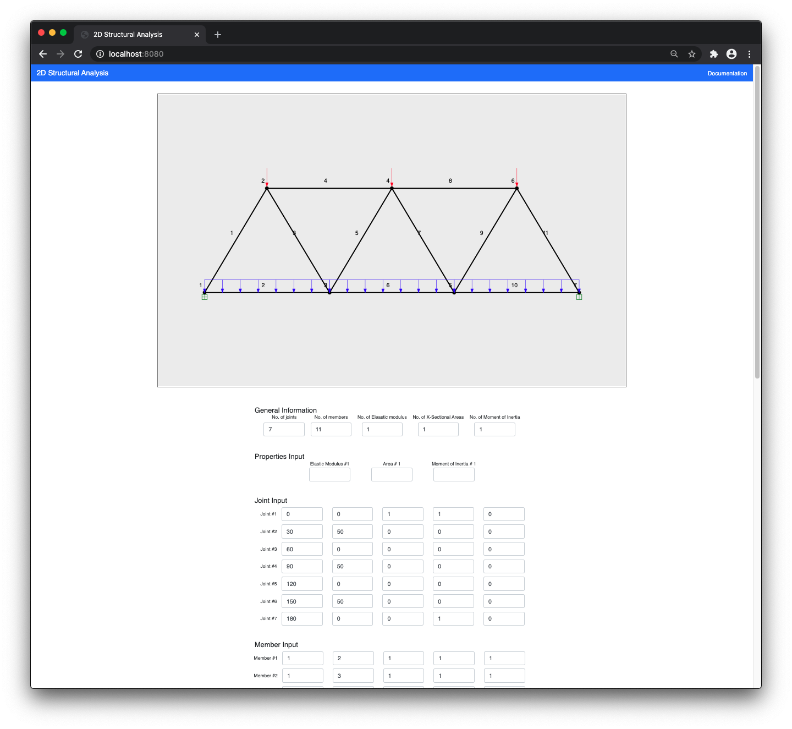

# Structural-analysis-program
A 2-dimensional structural analysis program (frames and trusses) written in Fortran95.

### The story
The Fortran program was built when I was in university. It required the user to write out the information in an input txt file, execute the program which would create an output file for the user with all the result information.

My intention was to create a web-based user interface. The MVP  was to have the client input the information into the form, have the server create the input file (txt) with the information, then execute the program and server the results back to the client.

Over time, I'd like add visual diagrams of the results and potentially host it on Heroku.

### Back-end
The back-end server is built using [node.js](https://nodejs.org) and [Express.js](https://expressjs.com/) - a node.js framework.

Using [fs](https://nodejs.org/api/fs.html) and [child_process](https://nodejs.org/api/child_process.html), the server takes the information submitted by the front-end input form and writes the input file, then executes the Fortran program. The Fortran program then writes  an output file which the server sends back to the front-end to be displayed to the client.

### Features to add
- A visual diagram of the structure with the loads shown
- A visual diagram of the internal forces (moment, shear & axial)
- A visual diagram of the support reactions (x-reaction, y-reaction & moment)
- A link for the client to download the output file

## Screenshot

### Home page


## Getting started
- clone repository to your local machine
- in terminal, run ```npm install``` in the project directory
- in terminal, run ```npm start``` in the project directory
- navigate to ```localhost:8080``` in your browser

## Dependencies

- [express](https://www.npmjs.com/package/express)
- [ejs](https://www.npmjs.com/package/ejs)
